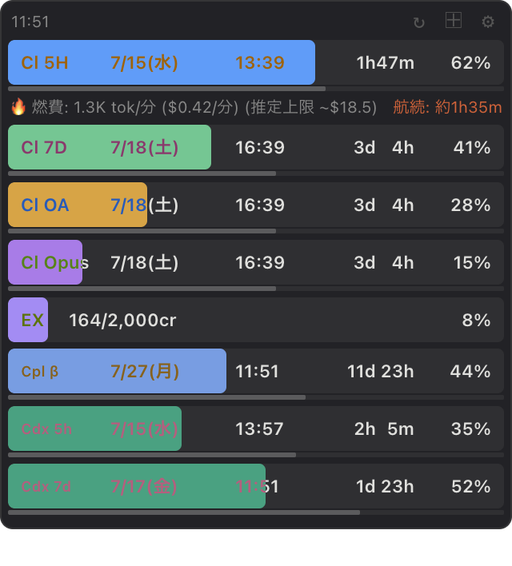
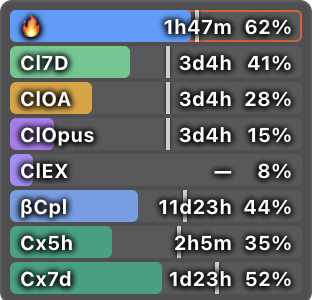
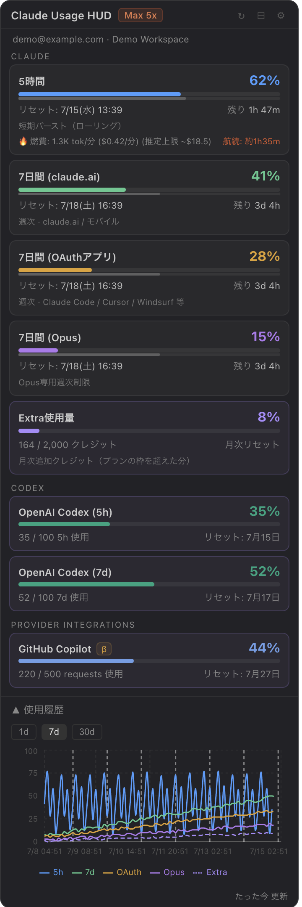
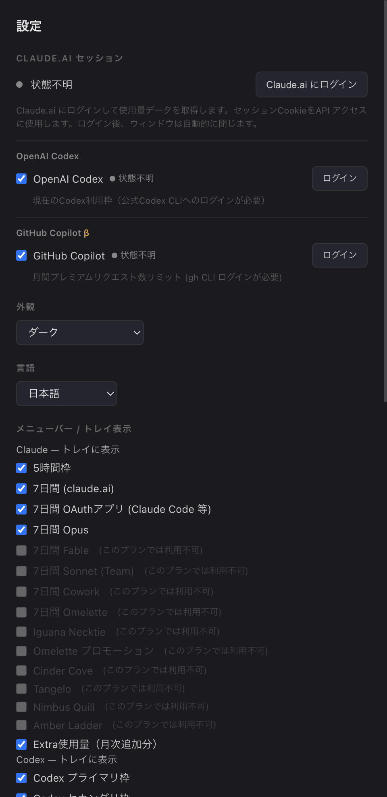

# Claude Usage HUD

> 🇺🇸 [English version](README.md)

Claude の使用状況をメニューバーとフローティングウィンドウで常時表示する、軽量なデスクトップ HUD アプリです。

> **claude.ai アカウント（Pro / Max 推奨）が必要です**

---

## スクリーンショット

<table>
<tr>
<td align="center" width="50%">
<br>
<sub><b>コンパクト表示</b> — 常に最前面の使用率バー</sub>
</td>
<td align="center" width="50%">
<br>
<sub><b>ウルトラコンパクト</b> — 画面端に収まる最小表示</sub>
</td>
</tr>
<tr>
<td align="center" width="50%">
<br>
<sub><b>詳細表示</b> — 使用量カード＋履歴チャート</sub>
</td>
<td align="center" width="50%">

<br>
<sub><b>設定画面</b> — プロバイダー・トレイ表示・アラート</sub>
</td>
</tr>
</table>

---

## 機能

### コンパクト表示
使用率をバーで一覧表示する、常に最前面のフローティングウィンドウです。

- **5H** — 5時間ローリングウィンドウ
- **7D** — 7日間（claude.ai / モバイル）
- **OA** — 7日間 OAuth アプリ（Claude Code, Cursor, Windsurf 等）
- **Opus** — 7日間 Opus
- **EX** — Extra 使用量（月次追加クレジット、有効時のみ表示）
- **Codex** — 公式Codex CLIから取得する現在の利用枠（有効時のみ表示）
- **燃費・航続** — Claude Codeはモデル別単価による概算`$/分`、Codexは利用枠の`%/分`とプライマリ枠到達までの推定時間を表示
- **β** — 試験的プロバイダーバー（GitHub Copilot — 有効時のみ表示）

### 詳細表示
リセット時刻・残り時間・使用履歴チャートを含む詳細ビューです。

### メニューバー / タスクトレイ
使用率をリアルタイムで macOS メニューバー / Windows タスクトレイに表示します。

### 外観
- **ダーク / ライト / 自動** テーマ（自動はシステム設定に追従）
- 透明度・最前面表示を調整可能

### アラート
各使用枠が設定した閾値を超えたときに OS 通知を送信します。

### プロバイダー連携
他の AI サービスの使用量データを任意で表示できます。

- **OpenAI Codex** — 公式Codex CLI App Serverから現在の利用枠を取得します。表示する枠名はプランから返された実際の枠長（例: 15m / 5h / 7d）に追従します。Codex CLIのインストールとChatGPTログインが必要です
- **GitHub Copilot** — 月間プレミアムリクエスト使用量。`gh auth token`（GitHub CLI のインストールとログインが必要）で取得します

**設定 → β プロバイダー** で各プロバイダーを個別に有効化できます。未ログインや API 変更などでデータ取得できない場合はカードに "Data unavailable" と表示され、他の機能には影響しません。

> Codexは公開されたApp Server APIを使用します。GitHub Copilotは引き続きCLI由来データを使う試験的機能です。

### 多言語対応
日本語・英語に対応。OS の言語設定を自動検出します。

---

## 動作環境

- macOS 10.12 以上 または Windows 10 以上
- [claude.ai](https://claude.ai) アカウント

---

## インストール

### macOS

1. [Releases](https://github.com/thivanao-jp/claude-usage-hud/releases) から最新の `.dmg` をダウンロード
   - `arm64.dmg` — Apple Silicon (M1/M2/M3/M4)
   - `.dmg`（サフィックスなし） — Intel Mac
2. `.dmg` を開き、**Claude Usage HUD** をアプリケーションフォルダへドラッグ
3. 通常通り起動できます（公証済みのため Gatekeeper の回避操作は不要です）

### Windows

1. [Releases](https://github.com/thivanao-jp/claude-usage-hud/releases) から最新の `.exe` インストーラーをダウンロード
2. インストーラーを実行（管理者権限不要、ユーザーフォルダにインストール）
3. インストール不要のポータブル版 `.exe` もあります

---

## 使い方

1. アプリを起動すると **Claude Usage HUD** アイコンがメニューバー / タスクトレイに表示されます
2. アイコンをクリック → 右クリック → **「設定」**
3. **Claude.ai セッション** セクションの **「Claude.ai にログイン」** をクリック
4. 表示されたウィンドウで claude.ai にログイン（ログイン後は自動的に閉じます）
5. 数秒で使用量データの取得が始まります

---

## 設定

| セクション | 内容 |
|---|---|
| **Claude.ai セッション** | ログイン・再ログイン |
| **外観** | テーマ: 自動・ダーク・ライト |
| **言語** | 自動 (OS設定) / English / 日本語 |
| **メニューバー表示** | 表示する使用枠を選択 |
| **更新間隔** | 1 / 5 / 10 / 30 分 |
| **フローティングウィンドウ** | 最前面表示・透明度 |
| **アラート** | 各使用枠の通知閾値 (%) |
| **OpenAI Codex** | 正式なCodex使用量追跡を有効化し、トレイ・アラートの枠を設定 |
| **β プロバイダー** | GitHub Copilotの使用量追跡を有効化 |

---

## 仕組み

非表示の Electron `BrowserWindow`（`persist:claude-ai` パーティション）で claude.ai のセッションを保持し、設定した間隔で claude.ai 内部 API から使用量を取得します。OAuth トークンや API キーは不要で、セッションはアプリ再起動後も維持されます。

---

## ローカル API サーバー（Claude Code 連携）

起動中、Claude Usage HUD は **`http://127.0.0.1:49485`**（ローカルホスト限定）でミニマルな HTTP サーバーを公開します。Claude Code のスキルなど外部ツールが OAuth トークンやブラウザセッションなしでリアルタイムの使用量データを取得できます。

### エンドポイント

```
GET http://127.0.0.1:49485/usage
```

**レスポンス**（JSON）:

```json
{
  "schema_version": 2,
  "generated_at": "2026-08-26T04:51:40.000Z",
  "five_hour": {
    "utilization": 43,
    "resets_at": "2026-04-17T08:00:00.000Z"
  },
  "seven_day": {
    "utilization": 12,
    "resets_at": "2026-04-21T00:00:00.000Z"
  },
  "extra_usage": null,
  "last_updated": "2026-08-26T04:51:38.831Z",
  "providers": {
    "claude": { "pace": { "provider": "claude", "source": "claude-code-jsonl" } },
    "codex": { "pace": { "provider": "codex", "source": "codex-rate-limit-delta" } }
  },
  "claude_code_pace": { "provider": "claude", "source": "claude-code-jsonl" },
  "cc_pace": { "provider": "claude", "source": "claude-code-jsonl" }
}
```

| フィールド | 説明 |
|---|---|
| `five_hour` | 5時間バースト枠 — `utilization`（%）と `resets_at`（ISO 8601 UTC） |
| `seven_day` | 7日間ローリング枠 |
| `extra_usage` | 月次追加クレジット、未有効時は `null` |
| `last_updated` | 最後に成功したデータ取得のタイムスタンプ |
| `providers` | プロバイダー別のv2正規形。ClaudeとCodexのpaceをフィールド名だけで判別できます。 |
| `claude_code_pace` | Claude Code JSONL由来の燃費・航続。価格表情報、系列フォールバック、未価格モデルも含みます。 |
| `cc_pace` | `claude_code_pace`の後方互換alias。Codexの予測値にはなりません。 |

Claude単価表は、起動時にリポジトリ上のJSONを厳格に検証してからキャッシュします。そのため、単価だけの更新はアプリのリリースを伴いません。上級者はアプリのuser-dataディレクトリへ同じschemaの`modelPricing.override.json`を置くと、最後に上書き適用できます。

直近の取得成功値を返します。未取得の枠は `null` になります。

### Claude Code の `rate-limit-guard` スキルとの連携

[`examples/claude-code/`](examples/claude-code/) ディレクトリに、すぐ使える [Claude Code](https://claude.ai/code) スキルが含まれています。5時間レートリミットに到達する前に長時間タスクを自動停止し、ウィンドウリセット後に自動再開します。

**セットアップ**（初回のみ）:

```bash
# ヘルパースクリプトとスキル定義を Claude Code ユーザーディレクトリにコピー
cp examples/claude-code/check_usage.py ~/.claude/scripts/check_usage.py
cp examples/claude-code/rate-limit-guard.md ~/.claude/skills/rate-limit-guard.md
```

**スキルの使い方**:

```
/rate-limit-guard              # デフォルト閾値 90% でチェック
/rate-limit-guard threshold=80 # 閾値を変更
```

5時間使用率が閾値を超えると、スキルは `resets_at` から待機秒数を計算して `ScheduleWakeup` を呼び出し、ウィンドウリセットまで作業を一時停止します。Claude Usage HUD が起動していない場合は警告を記録し、ガードなしで作業を継続します。

---

## APIレスポンス構造

> **最終確認: 2026-04-17**

使用量データは `https://claude.ai/api/organizations/{orgUuid}/usage` から取得します。

### 既知のレスポンスフィールド

| フィールド | 型 | 説明 |
|---|---|---|
| `five_hour` | `UsageEntry \| null` | 5時間ローリングバースト枠 |
| `seven_day` | `UsageEntry \| null` | 7日間枠 (claude.ai / モバイル) |
| `seven_day_oauth_apps` | `UsageEntry \| null` | 7日間枠 OAuthアプリ (Claude Code, Cursor 等) |
| `seven_day_opus` | `UsageEntry \| null` | Opus専用7日間制限 |
| `seven_day_sonnet` | `UsageEntry \| null` | Sonnet専用7日間制限 (Team Premium) |
| `seven_day_cowork` | `UsageEntry \| null` | Cowork専用7日間制限 (プラン依存、nullで観測) |
| `seven_day_omelette` | `UsageEntry \| null` | "Omelette" 7日間制限 (内部コードネーム、`utilization: 0` で観測) |
| `iguana_necktie` | unknown | 内部フラグ、常にnull — 追跡対象外 |
| `omelette_promotional` | unknown | 内部プロモーションフラグ、常にnull — 追跡対象外 |
| `extra_usage` | `ExtraUsage \| null` | 月次追加クレジット (Pro+プラン) |

`UsageEntry`:
```json
{ "utilization": 43, "resets_at": "2026-04-17T03:00:00+00:00" }
```

`ExtraUsage`:
```json
{
  "is_enabled": true,
  "monthly_limit": 5000,
  "used_credits": 123,
  "utilization": 2.46,
  "currency": "USD"
}
```

> **内部コードネームについて**: Anthropic は一部フィールドに内部コードネームを使用します（例: `omelette`, `iguana_necktie`）。予告なく名称変更・削除・置換される可能性があります。このアプリは未知・消滅フィールドを gracefully に処理します — null になるだけでUIから自動的に非表示になります。

### レートリミット

公式OAuthエンドポイント（`api.anthropic.com/api/oauth/usage`）はほとんどのユーザーで持続的な429を返します。このアプリは claude.ai Webセッションを使うことでこれを回避しています。

---

## 新しい使用量フィールドの追加方法

AnthropicがAPIレスポンスに新フィールドを追加した場合（新モデルやプランなど）、以下の手順で追加できます。

### 1. `src/renderer/src/fieldDefs.ts`（および `src/main/fieldDefs.ts`）に追加

```typescript
{
  key: 'seven_day_newmodel',
  shortLabel: 'New',
  labelEn: '7-Day (New Model)',
  labelJa: '7日間 (新モデル)',
  descEn: 'New Model weekly limit',
  descJa: '新モデル週次制限',
  alertLabelEn: '7-Day New',
  alertLabelJa: '7日間 新',
  showLabelEn: '7-Day New Model',
  showLabelJa: '7日間 新モデル',
  color: '#aabbcc',
  periodMs: 7 * DAY,
},
```

### 2. `UsageData` に追加（`src/main/claudeApi.ts` と `src/renderer/src/types.ts`）

```typescript
seven_day_newmodel: UsageEntry | null
```

### 3. `mapUsage()` に追加（`src/main/claudeWebFetcher.ts`）

```typescript
seven_day_newmodel: entry(src, 'seven_day_newmodel'),
```

### 4. DBカラムを追加（`src/main/db.ts`）

`CREATE TABLE` に追加し、`ALTER TABLE` マイグレーションブロックを追加します（`seven_day_sonnet` のパターンに従う）。

UI（コンパクト/詳細/設定/アラート/トレイ）は `WEEKLY_FIELD_DEFS` のイテレーションで自動的に更新されます。APIからnullが返るフィールドは設定のトグルとアラート閾値から自動的に非表示になります。

---

## 開発

### 必要環境

- Node.js 20+
- npm

### セットアップ

```bash
git clone https://github.com/thivanao-jp/claude-usage-hud.git
cd claude-usage-hud
npm install
```

### 開発モードで起動

```bash
npm run dev
```

### ビルド

```bash
# プロダクションビルド
npm run build

# macOS 配布物（arm64・x64 の .dmg + .zip）
npm run dist:mac

# Windows 配布物（.exe インストーラー + ポータブル版）
npm run dist:win
```

ビルド成果物は `dist/` に出力されます。

---

## 技術スタック

| レイヤー | 技術 |
|---|---|
| フレームワーク | Electron 30 |
| レンダラー | React 18 + TypeScript |
| ビルドツール | electron-vite |
| スタイリング | インラインスタイル + ThemeContext |
| データベース | better-sqlite3（使用履歴） |
| チャート | Recharts |

---

## CI / CD

バージョンタグをプッシュすると GitHub Actions が macOS・Windows のビルドを自動実行し、GitHub Release に成果物をアップロードします。

```bash
git tag v1.0.0
git push origin v1.0.0
```

詳細は [`.github/workflows/build.yml`](.github/workflows/build.yml) を参照してください。

---

## ライセンス

MIT
